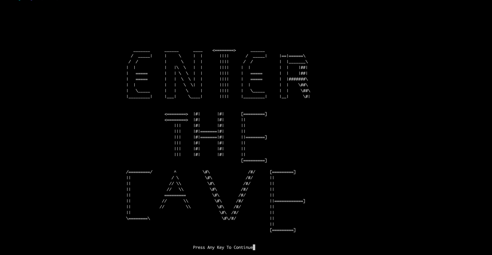
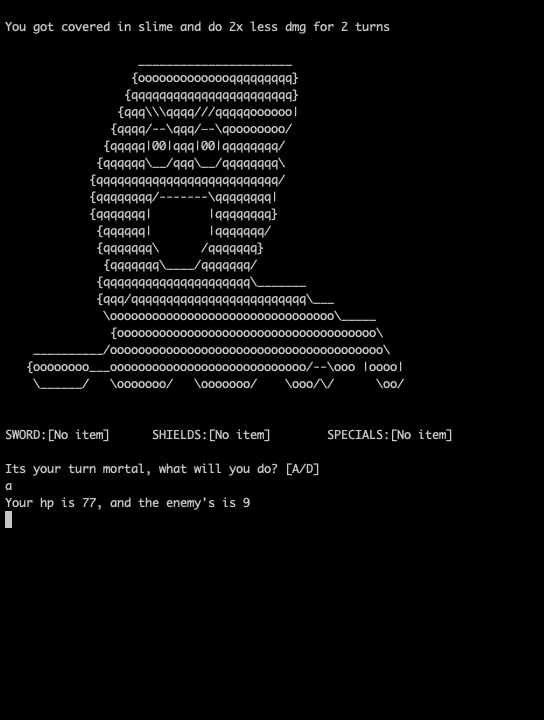
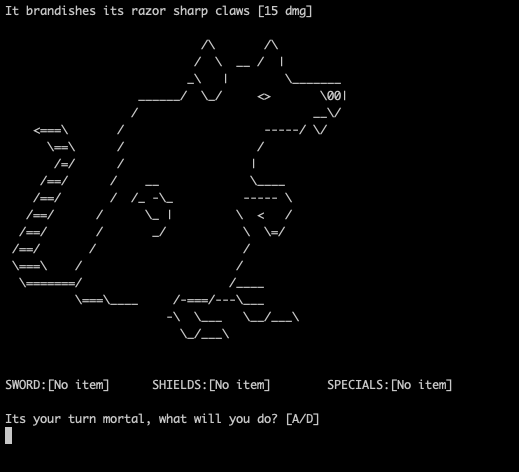
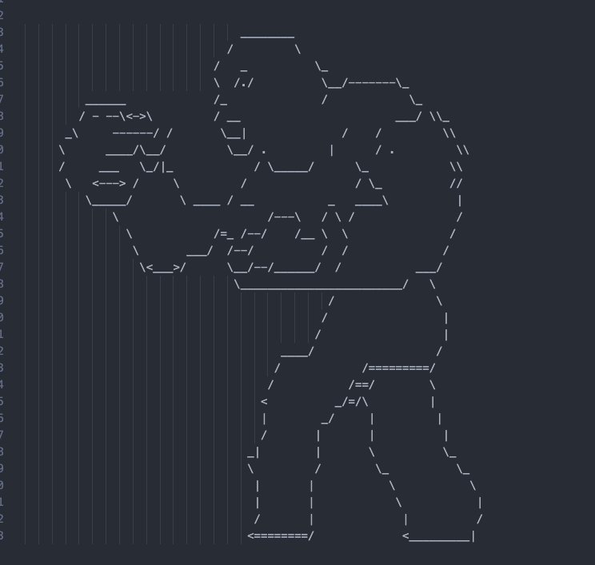
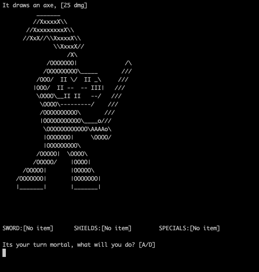
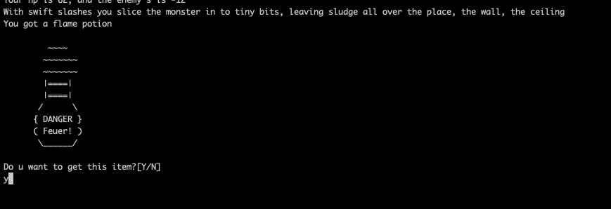
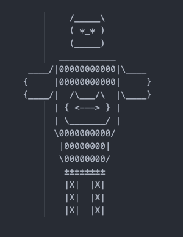

# THE CAVE

## A minigame / final project for a Computer Science course 'CS50' in 2019

# Features
* **Fight more and more powerful enemies as you descend deeper into the Cave**


* **Take down elites and bosses for a rewarding loot**
  
  
* **Pick up and use items capable destruction and defense**
  
  

# How to get started
1. Clone this repository ```git clone https://github.com/Mikisepic/Cave.git```
2. Get into the project's directory ```cd Cave/the-game/```
3. Remove the previous MakeFile ```rm cave_main```
4. Make the file ```make cave_main```
5. Launch the mini-game ```./cave_main```
6. Enjoy ;)

*Play on full screen for the best experience*